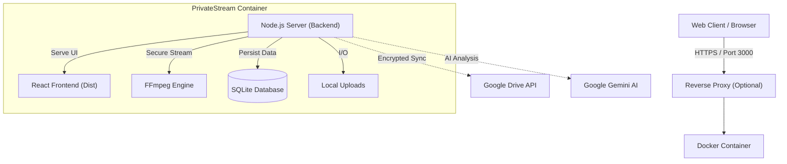

# PrivateStream NAS 🌌


**PrivateStream** adalah sistem **Secure Hybrid-Cloud Media Server & NAS** mandiri (Self-Hosted) kelas Enterprise. Sistem ini menggabungkan kecepatan penyimpanan lokal (NVMe) dengan skalabilitas penyimpanan cloud (Google Drive) dalam satu antarmuka modern yang terenkripsi.

Dirancang untuk privasi total, PrivateStream menghadirkan pengalaman streaming setara Netflix/Plex dengan keamanan tingkat militer dan manajemen pengguna yang lengkap.

---

## 🚀 Fitur Utama

### 🛡️ Keamanan & Akses (Enterprise Grade)
*   **Secure Authentication**: Login dengan Password Hashing (PBKDF2), manajemen sesi aman, dan fitur **Forgot Password** (Recovery via Token).
*   **User Management**: Admin dapat **menambah, menghapus, dan mengelola pengguna** (Anggota keluarga/Tim) melalui dashboard Settings.
*   **Zero-Knowledge Encryption**: File dienkripsi sebelum dikirim ke Cloud.
*   **Secure Downloads**: Fitur download file terproteksi yang memastikan file hanya bisa diakses oleh user terautentikasi dengan Content-Disposition yang benar.

### 🎬 Pengalaman Media Sinematik
*   **4K Streaming Engine**: Mendukung **HTTP Range Requests** untuk buffering instan, seeking, dan playback 4K HDR yang lancar di browser.
*   **Cinema Mode**: Tampilan Poster View, Metadata Film Lengkap (Sinopsis/Cast/Director), dan fitur **"Continue Watching"**.
*   **AI-Powered Organization**: Menggunakan **Google Gemini AI** untuk menganalisa gambar dan memberikan tag/deskripsi otomatis.

### ⚡ Sistem & Monitoring
*   **Real-Time Monitoring**: Memantau penggunaan **CPU, RAM, dan Disk Space** server secara akurat (bukan simulasi).
*   **Notification Center**: Pusat notifikasi persisten untuk memantau aktivitas sistem, login alert, dan status upload.
*   **System Logs**: Pencatatan log aktivitas server secara mendetail di database.

---

## 🏗️ Arsitektur Sistem

PrivateStream menggunakan arsitektur Monolithic yang didecouple menggunakan Docker:



---

## 🛠️ Panduan Instalasi (Quick Start)

Cara tercepat dan paling stabil untuk menjalankan PrivateStream adalah menggunakan **Docker Compose**.

### Prasyarat
1.  **Docker** & **Docker Compose** terinstall di komputer/server.
2.  (Opsional) **Google Gemini API Key** untuk fitur AI (Gratis di [Google AI Studio](https://aistudiocdn.com)).

### Langkah 1: Clone Repository
```bash
git clone https://github.com/Paichong29/privatestream-nas.git
cd privatestream
```

### Langkah 2: Konfigurasi Environment (Opsional)
Anda bisa membuat file `.env` atau langsung mengedit `docker-compose.yml`.
```env
# .env file
API_KEY=AIzaSy...PasteYourKeyHere
NODE_ENV=production
```

### Langkah 3: Jalankan Container
Jalankan perintah berikut untuk membangun dan menyalakan server:
```bash
docker-compose up -d --build
```
*Proses ini akan memakan waktu 1-3 menit untuk build frontend dan setup backend.*

### Langkah 4: Login
Buka browser dan akses: **http://localhost:3000**

*   **Default Username**: `admin`
*   **Default Password**: `admin`

> ⚠️ **PENTING**: Segera ganti password default Anda melalui menu **Profile > Change Password** setelah login pertama kali.

---

## 📖 Panduan Penggunaan

### Manajemen User (Baru)
1.  Login sebagai Admin.
2.  Masuk ke **Settings > Users**.
3.  Isi form "Create New User" untuk menambahkan anggota baru.
4.  User baru akan memiliki akses login sendiri namun berbagi library file yang sama.

### Lupa Password (Recovery)
Karena ini adalah sistem Self-Hosted tanpa SMTP Server terintegrasi secara default:
1.  Di layar login, klik **Forgot Password**.
2.  Masukkan email akun (misal: `admin@privatestream.local`).
3.  Token reset 6-digit akan **muncul di Server Log** (Terminal Docker).
    *   Cek dengan: `docker logs privatestream_nas`
4.  Masukkan token tersebut di layar konfirmasi untuk membuat password baru.

### Menggunakan AI Analysis
1.  Pastikan `API_KEY` Google Gemini sudah dipasang.
2.  Upload file gambar (JPG/PNG).
3.  Klik titik tiga pada file > **AI Analyze**.
4.  Sistem akan otomatis memberikan deskripsi cerdas dan tag.

---

## 🔧 Konfigurasi & Volume

Agar data Anda aman dan tidak hilang saat container direstart, PrivateStream menggunakan Docker Volumes:

| Path di Container | Fungsi | Lokasi di Host (Default) |
| :--- | :--- | :--- |
| `/app/uploads` | Menyimpan file media fisik (Video/Gambar). | `./uploads` |
| `/app/data` | Menyimpan Database SQLite (`privatestream.db`). | `./data` |

**Backup:** Cukup copy folder `./uploads` dan `./data` untuk membackup seluruh sistem NAS Anda.

---

## ❓ Troubleshooting

**Q: Stuck di layar "Decrypting Vault..." saat login?**
A: Pastikan backend menyala. Jika menggunakan Docker, cek logs dengan `docker logs privatestream_nas`. Pastikan tidak ada error database permission.

**Q: Bagaimana cara download file?**
A: Klik titik tiga (menu) pada file yang diinginkan, lalu pilih **Download**. File akan diunduh secara aman melalui server, bukan link langsung.

**Q: Reset Password Admin manual?**
A: Jika Anda kehilangan akses total, hapus file `data/privatestream.db` dan restart container. Akun akan tereset menjadi `admin`/`admin`. **Peringatan: Ini akan menghapus metadata file & user lain.**

---

## 📜 Lisensi

Project ini dilisensikan di bawah **MIT License**. Bebas digunakan untuk keperluan pribadi atau komersial.

---
*Built with ❤️ by PrivateStream Team.*
